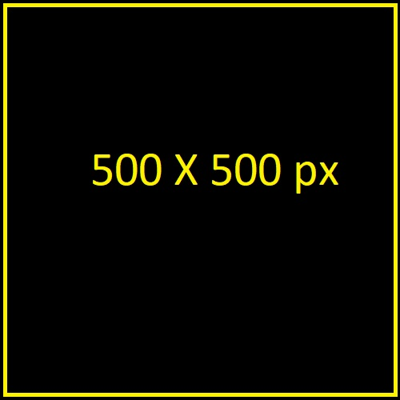

NOTE : If the browser wants to display 2 pixels of the image in 1pixel of the design : This will happen in high res screens.

1. Density switching : serve a large version of an image for high resolution screen and a smaller version of the same image for a low density screen.

1.1 High resolution screens use two physical pixels to display one pixel in our design.
This means that if you have a div of width 150pixels in you screen, If you have a high density screen you should send a 300 pixel image and if you have a low density screen you should send the 150pixel image.

2. Art direction : With this we want to tell the browser to use one image on a screen-width and another image for another screen width. Use html element <picture> and <source> element along with the  element.
 i.e we force the browser to use a particular image for a particular media query.

<!-- This means that if the 
: Width of screen is less than "37.5em/600px" + if the device pixel ration is "1.0" : 150by150M.jpg is served
: Width of screen is less than "37.5em/600px" + if the device pixel ration is "2.0" : 300by300M.jpg is served

: Width of screen greater than "37.5em/600px" + if the device pixel ration is "1.0" : 150by150.jpg is served
: Width of screen greater than "37.5em/600px" + if the device pixel ration is "2.0" : 300by300.jpg is served -->

    //Density switching and Art direction done below
    

         <!-- Under normal circumstances we use the below code 
        -->
        
        <picture class="img300">
            <!-- Density switching and Art direction done below : multipe source elements can be used 
            for different widths-->
            <source srcset="./img/150by150M.jpg 1x, ./img/300by300M.jpg 2x" media="(max-width:37.5em)">
            <!-- Density switching done below -->
            
        </picture>
    

                ----- CSS code BEGIN

                .responsive_image{
                margin : 50px auto;
                border: 1px solid red;
                width : 152px;
                height : 152px; 
                }

                .img300{ 
                    width : 100%;
                    height : 100%;
                    background-size: cover;
                }  

                ----- CSS code END

3. Resolution switching : How to allow the browser to decide the best image (..for the current view-port and pixel density values) to download using the "srcset" attribute.

        <!-- The browser does not have to know the width of the image to download it 
             At the moment the browser knows its viewport width and display density
             sizes attribute : This will inform the browser about the appox width ..
                               ..of the image at different viewport widths
                            
             Now along with the width descriptor 'w' and the values of the sizes attirbute..
                ..browser can then figure out the perfect image to use for the ..
                .. current viewport width and the current dispaly resolution-->

                           <!-- 
 -->
            <!-- Use the src attribute in the last, this is to make sure the image is 
                displayed if the srcset and sizes attributes are not supported by the browser. 
                700px is the default width if none of the other conditions apply-->
3.1 Based on your break points the "sizes" attribute values must be properly defined.                

         

<!-- using srcset - we first tell the images we have and their widths.
     using sizes - we tell the browser the width of the image at different breakpoints
     and the browser will automatically decide what image to pull based on 'viewport width + pixel density'
    
    MY assumption is you can not say at what viewport width a particular image will be pulled.
    This sounds like a more convinient way as - you just define what you have and leave the rest to the browser.

 -->
            ----- CSS code BEGIN

            .responsive_image3{
                max-width : 80%;
                margin : 100px auto;
            }

            .img_resswitching{
                max-width:100%;
                max-height:100%;
            }  

            ----- CSS code END